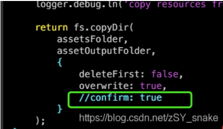

# gitbook 运行错误修复

### gitbook 编译报错 gitbook\gitbook-plugin-fontsettings\fontsettings.js'方法如下

~/.gitbook\versions\3.2.3\lib\output\website 目录下下的文件 copyPluginAssets.js 的 112 行和 67 行有问题。如下：注释掉`112行和67行`或者改为`false`

