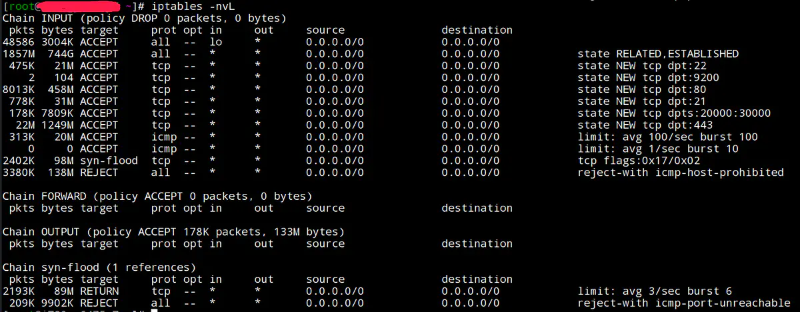
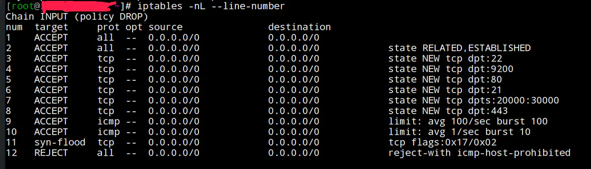

# iptables防火墙简单应用

> iptables默认情况下开通22（ssh）、80（http）、443（https）21、20000—30000（ftp）端口

## iptables默认端口及查看方法

### 查看规则命令

**iptables -nvL**



参数说明	-L, --list [chain]：列出规则，（注：L大写）
               	-v, --verbose：详细信息
              	 -n, --numeric：数字格式显示主机地址和端口号

### 添加新规则

```bash
#添加规则允许9200端口
iptables -I INPUT 4 -p tcp -m state --state NEW -m tcp --dport 9200 -j ACCEPT
#保存规则
service iptables save
#命令格式
iptables [-AI chain] [-io interface] [-p tcp,udp] [-s 来源 IP] [--sport 端口范围] [-d 目标 IP] [--dport 端口范围] -j [ACCEPT,DROP,REJECT]
#参数说明
	#-A：针对某个规则链添加一条规则，新添加的规则排在现有规则的后面。
    #-I：针对某个规则链插入一条规则，可以为新插入的规则指定在链中的序号。如果不指定序号，则新的规则会变成第一条规则。
    #[INPUT,OUTPUT,FORWARD] 入、出、转发
    #-p: 指定此规则适用于那种网络协议(常用的协议有 tcp、udp、icmp，all 指适用于所有的协议)。
    #--sport：限制来源的端口号，可以是单个端口，也可以是一个范围，如 1024:1050
    #--dport：限制目标的端口号。
    #-m：指定 iptables 的插件模块，常见的模块有：
    #	state：状态模块
    #    mac：处理网卡硬件地址(hardware address)的模块
    #--state：指定数据包的状态，常见的状态有：
    #	INVALID：无效的数据包状态
    #    ESTABLISHED：已经连接成功的数据包状态
    #    NEW：想要新建立连接的数据包状态
    #    RELATED：这个最常用，它表示该数据包与我们主机发送出去的数据包有关
    #-j：指定匹配成功后的行为，主要有 ACCEPT（通）、DROP（堵，不回应）、REJECT（堵，回应）。
    #[ACCEPT,DROP,REJECT]
    #	ACCEPT 一旦包满足了指定的匹配条件，就会被允许
    #	DROP 如果包符合条件，这个 target 就会把它丢掉，
    #	REJECT REJECT 和 DROP 基本一样，区别在于它除了阻塞包之外，还向发送者返回错误信息。
```

### 删除规则

~~~bash
#显示规则行号
iptables -nL --line-number 
#删除规则
iptables -D INPUT 1
~~~




